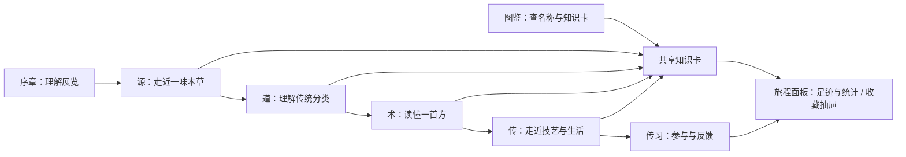

# 本草宇宙 · 民族文化与创新表达版框架

日期：2026-10-08。本文是本次文化改版的架构、内容口径与验收依据。发布结果与测试记录另见 [文化改版报告](../reports/2026-10-08-cultural-redesign.md)。此前的 [网站框架文档](website-framework.md)记录功能站阶段的设计，保留作为历史快照。

## 定位与表达原则

作品以“本草如何被认识、解释、配伍与传承”为线索，组织为“一扇门、四幕展览、一段个人旅程”。文化主题决定页面内容，数据图表帮助观众看见资料中的关系。完整图鉴继续服务检索，但不再承担整个网站的主导航。

项目以中医本草、经典方剂与相关非遗为主要资料基础，并通过藏医药浴等有明确来源的专题呈现民族医药文化的多样性。“民族文化”是参赛表达方向，不意味着现有数据完整覆盖所有民族医药体系。四气五味、归经与君臣佐使按中医理论说明，不推广为所有民族医学的共同分类。

每页遵循“文化问题 → 简明解释 → 可操作的资料 → 出处与边界 → 下一幕”。观众既可以顺序参观，也可以直接到图鉴找药；序章提供入口，不设置必须观看或倒计时解锁。

## 导航与共享层

主导航直接展示“序章 / 源·本草宇宙 / 道·性味归经 / 术·配伍成方 / 传·薪火相传 / 传习 / 图鉴”七个入口。前六项组成文化旅程，图鉴是检索工具；搜索、主题和收藏抽屉为全局工具。“我的本草之旅”面板放在“传”与“传习”页。移除“更多”菜单。

| 页面 | 路由 | 主要问题 | 页面承担的任务 |
|---|---|---|---|
| 序章·本草千年 | `#/intro`，无路由访问的入口 | 本草文化从哪里来？ | 传说与文献分层、七部典籍时间轴、三条文化线索、SVG星轨、进入展览 |
| 源·本草宇宙 | `#/home` | 为什么一草一木值得被认识？ | Canvas星图、三组不同口径文化数字、六味精选、四章阅读路径、四项实际KPI、覆盖折叠与后三幕入口 |
| 道·性味归经 | `#/qiwei` | 古人怎样解释本草的性质？ | 四气五味与归经文化说明、同一精品样本的属性图、药材证据 |
| 术·配伍成方 | `#/formula` | 多味药怎样组成一个整体？ | 君臣佐使解释、方剂网络、证候药链、样本洞察、方剂目录 |
| 传·薪火相传 | `#/heritage` | 知识怎样进入技艺、生活与书籍？ | 六非遗专题、106项食药目录搜索与每页12项分页、七部典籍札记、旅程面板 |
| 传习 | `#/learn` | 我怎样参与这段文化旅程？ | 5道文化题与25道原题共30题、来源生物照片题、反馈、旅程面板 |
| 本草图鉴 | `#/herbs` | 我想找一味药或一条名称 | 精品卡与名称索引分层检索，不与叙事页面重复铺陈 |

“我的本草之旅”面板汇总收藏数量、访问足迹、练习次数和最近阅读；现有收藏抽屉继续只管理收藏、取消收藏与JSON导出，没有把全部历史塞入抽屉。数据使用本机存储，不是云端账户或实名传承档案。药材知识卡和上下文条为共享详情层，跨页定位同一药材。旧 `#/zheng` 链接到达“术”的证候药链视图；旧首页食养、文化与典籍锚点转到“传”。

实现入口为 `window.HerbalCulture.renderIntro()`、`renderHeritage()`、`renderJourney(targetId)`；旅程监听现有收藏、药材选择、答题与storage变化事件。传统五行图例通过 `window.HerbalFivePhases` 共享；`culture-learning.js`在运行时读题库之前把5道文化题置前，稳定题目ID防止重复加载叠加。

## 一扇门：序章

序章先说明“神农尝百草”属于文化传说，《神农本草经》是后世托名的本草文献，避免将神农写成可考证的作者和准确生卒人物。三条主线为天人合一、生生之道、薪火相传，分别引向“道”“术”“传”。

编年采用分节点时间轴，每个节点同时展示年代、著作与统计单位。365 药、1,892 药与药典2020四部合计5,911项标准不是同类计数，不能做成“药材数量持续增长”的折线。365与周天的关联作为传统象征叙事讲述，不当作现代天文学或历法精确结论。

《本草纲目》使用1596年刊行的通行书目日期，区别成稿、刻板、进献与正式刊行。药典2020是历史节点与项目现有资料版本，不能标为2026年现行药典。

序章开场采用SVG星轨和CSS轻量动效；Canvas仅用于“源”的可交互星图。开场不阻挡主按钮、正文或键盘焦点，减少动效设置下仍直接显示全部入口与阅读内容。

## 第一幕：源·本草宇宙

首页从信息总汇改成展馆总览。星云表达“一草一木皆有其位置”，可点击对象以当前知识卡为准；18,817是全国中药资源普查背景规模，不是实际绘制并可点击的18,817颗药材星，也不是某个特定民族医药系统的资源总数。

首页仅保留文化引导、星图、背景说明、可点击馆藏、精选、后三幕入口与简短来源。食药目录和典籍阅读移交“传”，文化测验移交“传习”，避免同一长列表在三页出现。

馆藏数字从当前生成数据读取：902张知识卡、8,818条已收纳名称索引、100首方剂、624张有许可图片的卡。各数字进入相应资料，不把背景统计链接伪装成完整数据目录。“名称索引数÷全国资源总数”不能充当严格覆盖率，名称、药材、物种和标准不是一一对应关系。

## 第二幕：道·性味归经

四气解释为中医对药性寒热温凉的传统分类，“平”表示寒热偏性不明显；图表保留大寒、寒、微寒、凉、平、微温、温、热、大热九种实际标签，不把原始标签强行归并为四种。“四时之气”是文化联系，不表示四气由季节自动决定。五味以酸、苦、甘、辛、咸对应木、火、土、金、水的传统五行联系，淡、涩保留原始记录并作为补充图例。

五行配色兼作图例，不只靠颜色辨认，保留文字标签与选择状态。文化解释紧邻主矩阵，读者点击矩阵或排行后看到实际药材，再进入知识卡。归经与分类的关系图帮助理解样本归类，不作疾病诊断或因果效果图；此延伸桑基使用全馆藏样本，不随上方类别筛选。

核心属性图默认使用902张知识卡，选择类别后使用对应子样本，排除目录待补身份与原方物料。主五味按各味标签分别计数，因此合计可以超过样本数；矩阵增加“四气待补”灰行，保留缺四气但已有味型的记录，使各列合计与五味柱图一致。当前全馆藏900张有四气、2张四气待补，其中1张有已知主五味。缺失属性不推断为零。图例展示五主味与淡、涩共七项；淡、涩只作补充味型图例，未纳入当前主矩阵或主五味柱图。

版面按主矩阵、比例与排行、扩展关系的层级组织，共归经延伸图收进原生`details`。移动端依阅读顺序纵向排列，避免空白撑高和两个高密度面板强行等高。

## 第三幕：术·配伍成方

君、臣、佐、使以传统组方职责解释：主治、辅助、协调与引导。治国理政是便于理解的文化隐喻，不替代方剂学的具体定义，也不意味着每首方必须具有四种角色。

工作区按页内选择切换“读方剂网络 / 看配伍样本 / 查方剂目录 / 追证候药链”，分别对应 `#/formula?view=network`、`view=stats`、`view=directory`、`view=zheng`，选择状态使用`aria-pressed`。一屏集中完成一个关系任务；原文组成、古名、来源与角色集中在检查器，目录覆盖100首并保留检索与每页12首分页。证候药链进入同一页内，不再单独占主导航。

方剂图包含100首代表方，频次与共现只表示该样本；不得推成所有历史文献或临床处方的规律。V4与V5没有逐味标注君臣佐使，不自动生成角色。角色统计只取有明确角色标注的子样本，并说明分母。历史剂量保留原文单位，基础精选现代克数示例另作说明，不混做统一剂量排名。

## 第四幕：传·薪火相传

“传”独立承接技艺、生活与典籍，避免这些文化内容埋在首页底部或测验下方。

| 展区 | 内容组织 | 观众能做什么 | 边界 |
|---|---|---|---|
| 非遗技艺 | 针灸、炮制、藏医药浴、诊法、养生、同仁堂六个现有专题 | 看文化说明，打开对应官方条目 | 是六个专题，不是全国中医药非遗只有六项；养生专题对应具体名录条目 |
| 厨房里的本草 | 106个食药物质目录项、已补资料的精选摘要 | 查看目录明细、公告来源、对应药材卡 | 106是2002—2024公告汇总快照，不推断为实时最新总数；目录收载不等于任意食用都安全 |
| 典籍新读 | 七部本草文献与药典历史节点，原生`details`逐条展开 | 阅读札记和时代，回到序章时间轴、看出处与资料提示 | 不把古籍药物数与现代标准总数连成同类增长图 |

原方案提到“灸法、育婴六项”，与当前素材不符。本次使用已有六专题，不补造不存在的条目。针灸与藏医药浴分别以UNESCO2010、2018年代表作名录为依据；其余专题明确到国家级名录项目和公布批次。

六张非遗图片在原图像账本中为项目AI科普概念插画，页面必须明示，不能称作非遗现场实拍、传承人肖像或历史影像。药材开放照片是来源生物参考图，同样不能自动证明药用部位与炮制状态。

## 传习与个人尾声

文化测验有5题，围绕酸味与木、角色不求四类齐备、5,911标准口径、神农传说与后世文献、藏医药浴的独立知识实践，置于25道原题之前，总计30题。答案反馈含解释与来源标题，并提供回读对应展柜的链接；有来源URL的题另提供原出处链接，当前药浴题可直接核对UNESCO条目。来源生物照片测验继续保留，采用四选一与已有图像能力，不宣称能仅凭图片辨别全部药用部位或炮制状态。

收藏、最近访问和练习记录在“传”和“传习”的面板形成“我的本草之旅”；收藏管理仍使用全局收藏抽屉。记录只在当前浏览器保存，清理网站数据或换设备后不保证存在；不将它包装成跨设备账户。尾声帮助观众回到自己读过的资料，不生成未经观察的学习成就。

## 三主题与统一版式

日间、夜读、水墨古籍三主题通过`HerbalTheme`循环切换，旧`classic`值映射为`ink`。语义令牌驱动页面、卡片、菜单、抽屉、图表、tooltip与反馈；水墨主题采用纸色底、墨色文字与朱砂提示。字体使用系统回退，不加载外部字体。品牌和favicon为本草印章矢量符号，既有PWA栅格图标保留。

标题、导语、文化说明、主交互、证据区和下一幕入口有固定的阅读顺序。长目录分页，长说明折叠，图表按内容确定高度。顶栏和上下文条按实际高度避让，不复用造成遮挡的负外边距。减少动效模式直接呈现内容；按钮、页内标签和抽屉均须可用键盘访问。

## 赛道主题与可展示证据

以下是对“民族文化、创新表达”主题的展示映射，不是对未提供的比赛正式评分表或权重的推测。

| 展示维度 | 页面证据 | 评审或观众的具体操作 | 应避免的夸大 |
|---|---|---|---|
| 文化理解 | 源、道、术、传各有明确问题与解释 | 从序章顺序看四幕，读四气与君臣佐使的解释 | 用传统术语装饰图表，缺少可读解释 |
| 民族文化多样性 | 藏医药浴与中医相关非遗并列，带官方来源 | 打开药浴专题，核对2018年UNESCO条目 | 宣称所有民族医药采用同一理论或已全量覆盖 |
| 创新表达 | 星云意象、五行配色、印章、水墨主题 | 点击星点、矩阵或网络，看到资料证据；切换主题 | 宣称星点数等于18,817、配色等于临床证据 |
| 资料可信 | 馆藏分层、行级出处、图像许可、官方非遗条目 | 从知识卡、名录卡进入原始来源 | 把名称索引当药典核验、把AI插画当纪实照片 |
| 参与与传播 | 文化测验、收藏、足迹、下一幕入口 | 完成一题并查看解释，从旅程面板或收藏抽屉返回资料 | 把本机状态称作云端学习账户 |
| 作品完整性 | 默认序章、文化主导航、图鉴工具、旧链接兼容 | 新访问、直接深链、移动导航均能到达目标 | 仅更改标题，底层仍是重复页面与长列表 |

建议演示顺序：序章解释一条文化线索 → “源”点一味药 → “道”点一个矩阵格 → “术”查一首方的组成与来源 → “传”核对一个非遗专题并搜索食药目录 → “传习”答一题并从旅程面板返回资料。演示以完整链路和事实口径为重点，不以展示全部图表数量为目标。

## 数据快照与来源账本

本轮沿用数据版本10（2026-10-08），数字以 `reports/data-coverage.json` 和构建生成物为准：902张精品卡、961条运行时记录（另含17条目录身份与42条原方物料）、100首方剂、58个证候、624张有许可照片的卡、278张照片待补。名称索引与食药目录有独立分母。文化改版不把1,487条待审名称自动放量，未经行级证据复核的候选不进入默认检索。

| 资料 | 来源与用途 | 证据层级与读取边界 |
|---|---|---|
| 当前馆藏 | [生成覆盖报告](../reports/data-coverage.json)、[来源清单](../data/sources/source-manifest.json) | 项目构建结果；证明本项目收录状态，不证明全国资源覆盖比例 |
| 全国18,817资源叙事 | 既有README中的第四次全国中药资源普查统计快照 | 全国中药资源背景，不是民族资源细分表；本轮未取得新的可核对完整普查原表，继续补充直接统计来源 |
| 药典2020 | [国家药监局2020年第78号公告](https://www.nmpa.gov.cn/xxgk/ggtg/ypggtg/ypqtggtg/20200702151301219.html)、[既有学术统计交叉核对](https://www.tcmjc.com/doi/pdf/C843CFA557884A4D8C44DB44B2E961D3) | 官方公告链接在本轮非交互读取返回HTTP412；保留历史来源清单的读取记录，不宣称本轮已取得官方字节；5,911是四部合计标准，2,711是一部中药标准 |
| 《本草纲目》刊行日期 | [书目背景交叉核对](https://en.wikipedia.org/wiki/Compendium_of_Materia_Medica) | 本轮可读二级资料支持1596年刊行；具体古籍馆藏版次与影印本证据仍需进一步补齐，不能称为本轮官方书目核验 |
| 中医针灸 | [UNESCO条目00425](https://ich.unesco.org/en/RL/acupuncture-and-moxibustion-of-traditional-chinese-medicine-00425) | 官方条目，2010年；本轮读取到对应标题 |
| 藏医药浴 | [UNESCO条目01386](https://ich.unesco.org/en/RL/lum-medicinal-bathing-of-sowa-rigpa-knowledge-and-practices-concerning-life-health-and-illness-prevention-and-treatment-among-the-tibetan-people-in-china-01386) | 官方条目，2018年；本轮读取到对应标题 |
| 中药炮制技术 | [国家级非遗条目](https://www.ihchina.cn/project_details/14788.html) | Ⅸ-3，2006年第一批；展示专题可称炮制技艺，来源使用官方项目名 |
| 中医诊法 | [国家级非遗条目](https://www.ihchina.cn/project_details/14768.html) | Ⅸ-2，2006年第一批 |
| 中医养生 | [中医养生（中医传统导引法）](https://www.ihchina.cn/project_details/23850.html) | Ⅸ-10，2021年扩展项目；养生主题不等于所有生活行为均列入非遗 |
| 同仁堂中医药文化 | [国家级非遗条目](https://www.ihchina.cn/project_details/14852.html) | Ⅸ-7，2006年第一批；具体登记项目与泛称分开 |
| 食药目录 | [106项公告汇总及逐项归属](../data/sources/food-medicine-106.json) | 2002—2024公告汇总；每项保留所属公告，2024条目使用政府镜像并注明 |
| 方剂资料 | [V4来源](formula-sources-v4.md)、[V5来源](formula-sources-v5.md) | 基础21首、V4数字化29首、V5原文整理50首；出处、剂量和角色证据能力不同 |
| 开放药材照片 | [逐图许可账本](../IMAGE_SOURCES_V4.md) | 作者、许可、来源与文件哈希；照片只能作为来源生物参考 |
| 非遗概念图 | [旧图像清单](../data/image-sources.json)、[图像说明](../IMAGE_SOURCES.md) | `PROJECT-EDUCATIONAL`，AI概念插画，不能充作传承人或非遗现场纪录 |

## 验收与后续边界

本轮交付需检查所有新旧路由、四个方剂视图、三主题、文化题反馈与回读链接、旅程面板与收藏抽屉、目录钻取与旧证候链接；覆盖桌面和移动端、键盘操作、减少动效、空数据与图表加载失败。自动测试的数量和结果应在总检完成后写入报告，不能以设计完成代替实际验证。

后续文化深化优先补古籍影印本页码、各民族医药专题的独立文献与授权纪实素材。响应式缩略图、真实设备测试、现行目录更新与待补字段仍是独立建设任务。保留278张照片待补的真实状态，避免为扩大文化展示制造药材照片或临床解释。
