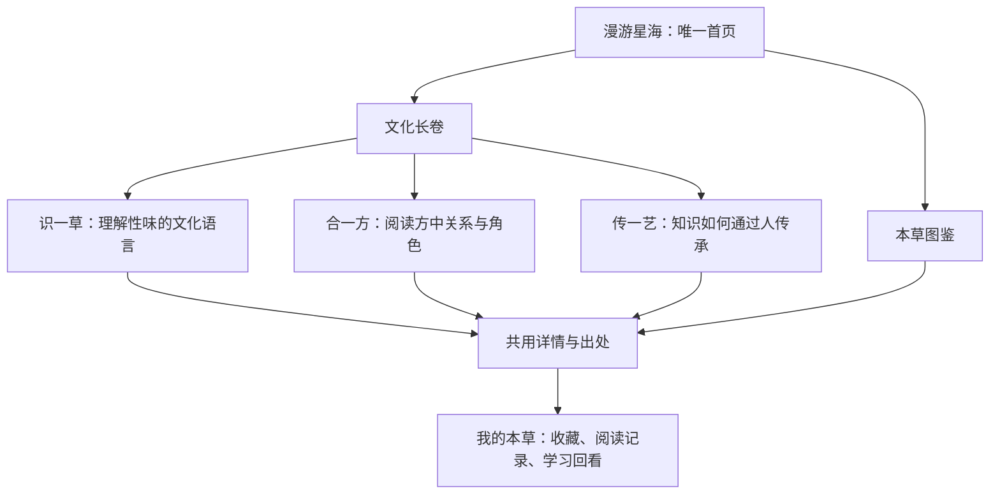

# 本草宇宙 · 网页项目框架 V7（已批准设计与实施对照）

> 状态：用户于2026-10-09批准B方案。三入口、三章文化互动、语义星带、按需WebGL与降级、本机札记已实现；本地验收见[发布报告](../../../reports/2026-10-09-v7-release.md)。下文保留批准时的设计与基线，性能目标不自动视作达成。首次入口轻量数据切片未交付；真实设备、非开发者研究与公开部署核验分别保留未完成状态。
> 日期：2026-10-09。核查基线：`37c61a7`。
> 项目：https://github.com/runner-cpu/Herbal-Cosmos
> 线上：https://runner-cpu.github.io/Herbal-Cosmos/
> 依据：用户提供的 V6、当前代码与线上交互、用户提供的 2026 年竞赛评分标准摘录、下文列出的公开参考。

## 1. 结论与定位

建议进行一次**信息架构与核心体验重构**，保留可靠的数据、检索、来源账本、主题和测试资产。V6 已解决部分工程问题，但尚未解决“观众为什么走进来、先体验什么、离开时记住什么”。

推荐名称与传播文案：

**本草宇宙 · 一草一世界**  
中华医药文化交互展  
从识一草、合一方到传一艺，看见草木、知识与人的关系。

“宇宙”是认识文化关系的空间隐喻：观众从一颗星进入一味本草，从一束连线理解一首方，从一段技艺看到传承的人。星空要有可读的结构，文化解释要能回到出处。

主要受众为对传统文化感兴趣、没有医学专业背景的青年与普通公众；主要场景是校园文化展示、浏览器自主探索与比赛现场三分钟演示。核心体验目标是：**看懂一个关系、查到一个出处、留下自己的理解**。

本项目以现有中医本草资料为主要编目基础，以藏医药浴等有官方来源的专题呈现文化多样性。不以少数民族数量代表赛道贴合程度，不把中医性味分类直接套给其他医药体系。目前收到的是统一评分标准，尚无赛道完整命题正文；以下不冒称主办方要求必须覆盖若干民族。

## 2. 已确认的仓库与网页情况

### 2.1 版本与检查范围

- 本地 `main`、远端 `main` 与 `gh-pages` 都指向 `37c61a7c0b00a0f177bedf5151eb0f1f5e688863`。开始核查时工作区干净。
- Pages 的 `index.html`、`cosmos-engine.js`、`cosmos.js`、`culture.js`、`sw.js` 五个文件均返回 200，内容 SHA-256 与对应 Git 提交文件一致。比较对象是 Git 文件，排除了 Windows 换行转换的影响。
- 本轮运行 `npm test`：124/124 通过；`validate:app`：67 文件、0 issue；浏览器副本检查同步。
- 本轮直接检查序章、首页、性味页、配伍页的线上结构与桌面表现，实操了星图拖动；读取了 375×812 模拟视口的布局尺寸。未在本轮重跑完整浏览器套件，未进行真实手机或真实 Safari 验收，不能把已有测试报告算作本轮全量通过。
- V6 描述的死代码移除、典籍和旅程面板去重、精灵星图引擎已经进入这五个新提交，不再列作待修的旧问题。

### 2.2 数据基线

下列来自当前生成报告及站点；数据规模是保存的资产，不是本轮继续扩张的目标。

| 数据 | 当前口径 | 表达边界 |
|---|---:|---|
| 本草知识卡 | 902 | 803 完整、96 部分、3 基础；不全部称为精品 |
| 运行时实体 | 961 | 另含 17 个目录身份条目、42 个方剂物料，不混入 902 分母 |
| 名称索引 | 8,818 | 可检索名称，不等于完整药性档案；另有 1,487 待审候选 |
| 方剂 | 100 | 181 个关联药材、621 条方剂—药材关系，属于馆藏样本 |
| 证候 | 58 | 作为资料索引保留，不增设诊断入口 |
| 食药物质目录 | 106 | 当前项目采用 2002—2024 公告整理快照，不称实时最新 |
| 有许可图片的知识卡 | 624 | 卡数，不等于独立图片文件数；278 卡照片待补 |
| 归经／分布／来源覆盖 | 814／614／899 | 均以 902 卡为分母，保留缺失状态 |
| 民族医药对照候选 | 37 | **正式通过 0、待核 37**；当前无法支撑已完成的跨体系星群 |

### 2.3 本轮发现的真实问题

| 优先级 | 发现与证据 | 影响及处理方向 |
|---|---|---|
| P0 | 线上拖动星图重复报 `ReferenceError: lastY is not defined`，位置 `cosmos-engine.js:393`；声明与 pointerdown 均未初始化它 | 拖动失效，手势结束还会误选药材；补齐指针生命周期，并用真实拖动回归验证 |
| P0 | 激活的“资料分类”按钮实际文字色 `rgb(35,48,31)`，底色 `rgb(25,55,43)` | `site.css` 的高优先级深色按钮底覆盖了 `culture.css` 的金色激活底，导致深字深底；统一状态样式和对比度验收 |
| P1 | `buildStars()` 按数组序号生成等半径球面，切换读法只调用 `paint()` | 星辰缺少有意义的空间编码；“地理自然聚成一簇”不是当前能力 |
| P1 | `regionOf()` 取来源数组中第一个能匹配的大区；映射把多省归入宽泛的“东南”，部分省区未覆盖 | 丢失多地记录，不能把这一颜色解释为唯一来处、道地产地或民族归属 |
| P1 | 桌面首屏光晕大量叠加，星图呈明亮球团，单颗星与分类颜色不易辨认 | 降低全局光晕，强化暗部、前后层次与被选对象；不要只增加粒子 |
| P1 | 七个并列导航，且序章与“源”都承担入场和导览 | 观众经历两次首页；“源／道／术／传”需要先学习才能选路 |
| P1 | 性味页先长篇释义再连续呈现矩阵、排行、占比、柱图与流向；配伍页默认展开全网和百首索引 | 文化命题退为图表前言，首次进入便承担专业分析负担 |
| P1 | 传承局部导航仍含“共同的本草”，其对应内容因 approved=0 隐藏 | 存在指向空专题的入口；内容与导航应由同一可见性条件生成 |
| P1 | 首屏《本草纲目》数字仍指向传承页“典籍读法”，完整典籍时间线已移到序章 | 去重后入口语义未同步；所有链接迁移需要验收其到达内容 |
| P1 | `featured.js` 仍有“中药抗生素”“第一要药”等解释性文案，四君子汤中的茯苓角色与单卡 note 还不一致 | 文化展不应沿用无出处的现代药理类比和绝对性宣传；逐项核对，角色必须绑定具体方剂、版本和解释来源 |
| P2 | 375×812 模拟视口中 canvas 高 860px、控制面板约 355px；canvas 使用 `touch-action:none` | 移动首屏控件偏重，纵向阅读容易与手势争抢；改为短工具条、明确进入漫游、底部详情 |
| P2 | 文化主线尚未区分“原典证据”“项目导读”“概念插画”的主次阅读 | 来源说明虽有，但很多需要先读长段免责声明；主叙事精简，具体证据就近展开 |

说明：移动端确认的是布局与 CSS 事实，尚未完成真实触屏手势实测。测试全绿并不意味着拖动、视觉对比度和文化论证都已可靠。

## 3. 对 V6 的取舍

保留：来源可追溯、缺字段不编造、资料分层、同一资料不重复完整渲染、经典脚本降级能力、无障碍和浏览器回归。

改写六项判断：

1. **“保持八路由、七导航就是内容克制”不成立。** 入口数量、默认展开的任务数与主线长度才决定阅读负担。技术路由可以多，观众入口应少。
2. **“页面至少三屏”应删除。** 页面长度不是完成度，不为填满空间增加重复文案。以是否完成一个观众任务验收。
3. **“四种换色就是核心创新”力度不足。** 让位置、关系、选中反馈和出处共同参与表达；颜色只能承担其中一个维度。
4. **“已有药材只需民族显影”证据不足。** 同名、别名、产区不能直接推出特定体系中的药物身份、用途或知识互通。新增关系需要独立证据，不能给 37 条候选随便填 URL 就过审。
5. **“换色不改几何”与“切换后地理聚类”矛盾。** 新版明确每个视图的布局语义；无空间依据的视图不宣称真实地理关系。
6. **技术与赛事判断要证据化。** 不沿用未核验的“药典藏蒙维专章”表述；不以估算分配次数证明真实帧率；不认为采用 Three.js 必然破坏静态部署，也不认为换框架本身构成创新。

V6 中“三层数字通过揭示动画自然看懂”的推论也过强：6,000 粒装饰尘埃不能直观代表 18,817 种资源。新入口只提示“每颗可选星辰对应一张知识卡”；资源普查和索引数字进入资料说明。

## 4. 三个可选方向

| 方向 | 内容与体验 | 得失 |
|---|---|---|
| A：V6 修补版 | 保留七导航，修星图、调排版、补少量专题 | 风险低，但仍像一组工具加文化前言，原创表达提升有限 |
| **B：星海入口＋三章文化长卷＋资料图鉴（推荐）** | 一个视觉入口、三次有明确目的的文化交互、一个完整资料层 | 兼顾记忆点、学习路径、可验证数据；需要重组页面和场景状态 |
| C：全三维虚拟展馆 | 空间走动、展厅漫游、自由镜头 | 空间制作与适配成本高，容易把主要工作变成场景搭建；触屏与评审操作负担更大 |

选择 B。用户可以自由探索，也可以一键走完三分钟文化旅程。整体重组页面，但不迁移到 React、不重建数据系统、不添加账户后端。

## 5. 新信息架构：三个主入口，一个个人工具

顶部只保留“漫游星海／文化长卷／本草图鉴”。搜索、我的本草、主题设置为工具，不再与展览章节争夺导航位置。

| 空间 | 默认回答的问题 | 默认内容上限 | 深入方式 |
|---|---|---|---|
| 漫游星海 | 我能在这里发现什么？ | 一个星海、一个简短引导、一个被选对象 | 选星、检索、进入长卷或档案 |
| 文化长卷 | 本草知识如何形成关系并传承？ | 三章，每章一主图、一核心动作、一短结论 | 章内来源展开、转入图鉴分析 |
| 本草图鉴 | 我想查的资料在哪里？ | 一组筛选、一种主视图、一个详情 | 本草／方剂／文化资料三个资料标签 |
| 我的本草（辅助） | 我理解并留下了什么？ | 收藏、足迹、学习回看 | 保存本地阅读笺、导出 |

原 30 道传习题保留在学习回看中，不要求逐题答完才能参观。原 106 食药目录和六项文化专题保留在资料层，不在主线一次铺满。

### 5.1 路由与兼容

推荐新增 `#/exhibit?chapter=recognize|compose|inherit`。首页继续使用 `#/home`；图鉴继续使用 `#/herbs`；知识卡保留 `#/herb?id=...`。`#/learn` 可继续作为“我的本草”的兼容地址，不必为了命名新增路由。

| 旧入口 | 新入口或兼容处理 |
|---|---|
| 根地址、无参数 `#/intro` | 唯一星海首页 |
| `#/intro?anchor=intro-timeline`、典籍旧锚点 | 图鉴的文化资料／典籍时间线，定位真实对应内容 |
| `#/home` | 星海；历史馆藏、来源锚点转图鉴对应区域 |
| `#/qiwei` 及其筛选 | 图鉴本草／属性分析；保留已知参数，提供文化长卷入口 |
| `#/formula` 及方剂、证候参数 | 图鉴方剂／相应详情或关系视图；保留样本分析 |
| `#/heritage` | 文化长卷“传一艺”；食药、经典等具体锚点转资料层 |
| `#/herbs?mode=catalog` | 名称索引；知识卡与名称索引仍明确区分 |
| `#/saved`、`#/learn` | 我的本草；收藏与旧存储迁移无损 |

增加集中式路由迁移表与逐条回归，不用各页面自行猜测旧参数。全站返回键恢复章、选择、筛选和滚动位置。保留到达真实资料的能力，不保留重复的顶层菜单。

## 6. 核心体验设计

### 6.1 漫游星海：从一粒墨，走进一味本草

首页打开即能交互，不经过独立序章，不播放不可跳过的片头。

- 视觉构图：不再把均匀发亮的球体置于正中。以斜向舒展的星带、疏密与暗部构成纵深，保留大面积可读文字区；细线像书页脉络，在选中后才显现具体关系。
- 最多约 1.5 秒的入场：书页墨点的抽象意象渐入星海。此过程是视觉隐喻，无统计含义；减少动效模式直接终态。
- 初始只显示项目题名、一句定位、“开始三分钟旅程”和简洁搜索；详细图例按需展开。不要同时显示两个搜索框、两组着色开关和十几项图例。
- 可选星辰仍与知识卡一对一。星尘完全不可选、不可计数，不制造虚假药材或关系。
- 星海以资料分类作稳定分组，每组位置是设计布局，不是假装地理坐标或算法发现；选择一组可见数量及完整清单。光晕只突出悬停、选中和关联对象。
- 点星：相机短距靠近，其他星点降亮度，出现名称、参考图、短解释和“档案／看关系”入口。详情打开与关闭不丢失位置，不自动跳离当前页面。
- “看关系”只显示有记录的方剂—药材边，默认围绕当前对象展示；没有关系时明确写“本馆尚无关联记录”，不自动造线填空。
- 图例明确：大小不代表药效，距离不代表相似度；只有关系视图中的连线承载数据。

桌面布局为左侧约 25% 题名／引导、主体约 75% 星海；选中后右侧详情占固定阅读列，场景同步让出空间。移动端改为短标题、独立星图视窗和下方详情，默认允许纵向滚动；点“进入漫游”后才接管复杂手势，始终有退出按钮。

### 6.2 文化长卷第一章：识一草——古人怎样描述草木？

核心问题：性味是一套怎样的传统知识语言？

核心互动是**五味关系星图**：酸、苦、甘、辛、咸形成五个可读的关系节点；选定一味本草时，与其已记录味型相连。复合味只对应一颗药材星、可有多条味型边，不复制成多个药材。淡、涩单列补充，不强塞五行。没有五味记录的星保留待补标记。

首次只呈现一个经过内容复核的小样本，让观众点击一次就明白“一物可以有多种描述”。“查看全馆统计”才进入图鉴的矩阵、归经排行和分布。五色具有传统对应含义；数量另用明确数字与图例表示，不以五个扇区面积暗示精确占比。

主文案说明传统分类语境，来源抽屉列出具体条目与解释出处。不把四气画成实测温度，不把归经画成现代解剖定位。典籍时间线只作一次简短引入，完整七节点放在文化资料中。

### 6.3 第二章：合一方——一味本草怎样进入关系？

核心互动是**从散星到一方星座**：进入一首经过核对的代表方，关联药材从星海中留下，其他对象隐去；以“方剂节点—药材节点”的明确双部关系组织画面。

首展优先核验现有四君子汤，另选两首形成可切换案例；默认只开一首，不显示 281 节点全网。角色说明引用具体资料，缺失或存在不同解释的角色不得按药材名或剂量自动推断。若首选案例无法补齐，换用已通过核验的案例并在交付报告记录，不上线空壳。

用户可依次点亮君／臣／佐／使的已记载角色，查看“这条连线来自哪首方、哪个版本、哪一段解释”。不用星体大小或连线粗细表现临床贡献，不按克数推算配伍角色。

互动限定为“读方”：可以隐藏／重显组成观察结构，不提供自由加减药、剂量计算或个性化推荐。全量 100 方与样本排行、共现分析保留在图鉴方剂中；高频不解释为疗效更强。

### 6.4 第三章：传一艺——知识为什么要由人传下去？

这一章停止密集星点，让展览回到具体文化实践。默认专题为**藏医药浴法 Lum**，以 UNESCO 第 01386 号官方条目为依据。

核心互动为“展开传承脉络”：从实践形式，展开到传承参与者，再展开到生活与教育中的传承场景。仅展示来源明确陈述的关系；线表示名录所述参与／传承，不表示本项目重建了真实师承谱系。

专题首屏以当代排版、有限的线描与现有概念图承载，明确图像性质；不把中医五行直接套入藏医体系，不用虚构服饰、传承人肖像或伪古籍增加所谓民族感。不复刻曼唐或其他图式而声称已获得专业核验。

章内提供“中药炮制技艺”作为第二专题切换，仍共用这一套“对象—技艺—传承”的阅读方式，默认不同时展开。净制、切制、炮炙应按具体来源呈现分类或案例，不能把不同工艺拼成所有药材必经的线性流程。其余四个文化主题进入资料图鉴。

章末让用户选择自己最有感触的一个关系，保存一张**本草阅读笺**：标题、所看对象、本人选择的一句理解、来源链接、展馆链接。允许编辑文字和导出 SVG／打印，不自动生成药理结论，也不自动发布到社交平台。原题库可作为“再读一题”的自愿延伸。

## 7. 信息减量与视觉秩序

| 当前内容 | 新版处理 |
|---|---|
| 序章与源页的两套首屏 | 合并为星海入口；典籍完整资料移入图鉴 |
| 每页大段文化宣言 | 改成一个问题、一次操作、一条结论；完整解释按需展开 |
| 性味页默认四五张图并列 | 长卷仅一张关系主图；统计图在图鉴以主图切换显示 |
| 配伍默认全量网络 | 长卷默认一首方；全网为资料层主动选择 |
| 传承页六主题＋106 食药目录＋读典方法 | 主线默认一个案例，可切第二个；目录归资料层 |
| 独立传习导航 | 合并到我的本草，章末提供自愿参与 |
| 多处收藏与旅程统计 | 统一个人工具；选中详情只保留收藏动作 |
| 18,817 等背景大数字 | 移到资料说明，并标统计对象与时间；不用于首屏夸张规模 |

排版规则：

- 桌面一章默认一个占主要面积的视觉、一个说明列，不以四张等权卡片代替叙事；正文列约 24—32 个汉字宽，正常正文 16px 左右。
- 图表标题、样本口径、控制器、图形、结论有固定顺序；解释过长时移到相邻可展开区域，不留下与短列竞争的大块空白。
- 选中详情采用 Grid 的真实列，不用高 z-index 覆盖正文；移动端详情落到图下或有明确关闭方式的面板，不遮挡主操作。
- 星海采用稳定的深墨绿展陈背景；日间／夜读／古籍主题主要控制阅读表面，三种主题下都校验文字与图例。夜读阅读区使用深色表面，不出现白卡深浅字混配。
- 金色用于主要动作和选中，朱色只作文化标记；五味颜色属于数据编码，可多色，但与装饰配色区分。
- 背景使用细颗粒纸纹与克制光场；不叠加旋转粒子、极光、鼠标尾迹和多层文字动画。没有内容理由的动效不进入主线。
- 中文标题用现有可用宋体／衬线系统，正文用清晰无衬线；关键字体本地或系统回退，不能依赖外部字体成功才显示标题。

## 8. 开源与公开案例研究

以下区分“已阅读资料／实看演示”与“计划采用”，不把他人功能写成自己已有能力。核查日期均为 2026-10-09。

| 参考 | 本轮核查 | 借鉴与边界 |
|---|---|---|
| [诗云 Cohenjikan/shiyun](https://github.com/Cohenjikan/shiyun) · [演示](https://shiyun.cohenjikan.com/) | 阅读 README、架构文档、许可，打开了实际星海演示；其 README 与演示规模存在不同快照，本方案不借用其数字 | 借鉴实体星辰、焦点飞近、局部关系、可恢复的阅读状态。当前代码为 **PolyForm Noncommercial 1.0.0**，属于带非商业限制的源码公开项目，不误称 MIT；本轮仅参考交互原则，不复制其代码、素材、视觉构图、品牌或诗歌生成算法 |
| [Three.js](https://github.com/mrdoob/three.js) | 阅读官方仓库说明，许可 MIT | 计划用于按需加载的粒子绘制与相机，不引入 React Three Fiber；原创内容仍是本草的布局、交互与证据组织 |
| [3d-force-graph](https://github.com/vasturiano/3d-force-graph) · [节点聚焦示例](https://vasturiano.github.io/3d-force-graph/example/click-to-focus/) | 阅读 README 与聚焦示例源代码，许可 MIT | 借鉴“选中对象—镜头聚焦—局部关系”模式；本次不整包嵌入，不默认把 902 卡做成不停抖动的力导向毛球 |
| [Scrollama](https://github.com/russellsamora/scrollama) | 阅读 README、sticky 与移动端模式说明，许可 MIT | 借鉴原生滚动、IntersectionObserver、图文随段落变化的组织方式；优先用原生观察器与按钮实现，不做滚动劫持 |

“诗云”的可学习之处是空间与内容对象建立明确契约，诗歌索引的 rank/unrank、虚空随机诗等机制不适合本草：药物资料不能通过生成文字来凑成知识卡。

未确认用户口中的“星辰”“知识宇宙”各自指向哪个同名项目，因此不编造指定仓库的调研结果；采用上述已核验的星海、图谱和叙事案例满足对应参考方向。后续如有指定链接，可比较其适合本项目的具体交互。

## 9. 技术方案与数据契约

### 9.1 选择：原有静态架构＋局部 WebGL 增强

保留原生 JS／CSS、静态数据与 GitHub Pages。重构路由和展陈层，不重新搭一套 SPA 框架。

星海主渲染采用按需加载的 Three.js `Points` 与自定义粒子材质，支持分组布局、可控形态过渡、局部连线和焦点相机。第一版使用粒子自身柔光，不把全屏重度后处理 Bloom 作为依赖。仅为渲染模块增加可复现的小型打包步骤、版本锁与本地 vendor 产物；避免生产依赖公共 CDN。

当前 Canvas 引擎修复后作为降级路径，共用选择、布局及数据接口。无 WebGL、资源加载失败、`file://` 或性能不足时使用 Canvas／静态 SVG 与文字列表；完整动画仅在 HTTP(S) 下保证，双击直开仍保证基本查询与文化阅读。

选用 WebGL 的理由是可控的空间过渡与合批渲染，不是为了代码复杂度。实现中若增强模块超过预算或无法稳定拾取，发布可用的 Canvas 同语义版本，并在实际交付中明确增强能力未达标，不能把未验证能力写入成果。

### 9.2 模块职责

| 模块 | 职责 | 不能承担的职责 |
|---|---|---|
| 资料适配层 | 区分知识卡、名称索引、方剂物料，提供稳定 ID 与来源 | 不补造缺失药性、地理或民族标签 |
| 关系与布局层 | 输出确定性位置、节点和带类型的关系 | 不把空间接近解释为药效或历史关系 |
| 场景渲染器 | 绘制、相机、拾取、暂停与降级 | 不直接修改收藏、不临时推导文化结论 |
| 展览状态 | 当前章、案例、选中对象、动作状态和 URL | 不把页面临时浮层当全局药材上下文 |
| 共用详情 | 短档案、来源、收藏、返回当前阅读 | 不自动跳到别页或覆盖主操作 |
| 资料图鉴 | 全量检索、筛选、统计、比较、目录与文献 | 不再承担首次参观者必须读完的故事 |

同一套关系数据用于 Canvas、WebGL 和文字视图；切换渲染器不改变计数或知识解释。页面离开、文档隐藏或场景不在视窗时停止绘制；减少动效时不保留永久动画循环。

### 9.3 文化证据最小结构

为三个展览案例单独组织轻量数据，引用既有实体，不把文化断言塞入自由文本 note。每条对外断言包含：

- 唯一 ID、所属案例、断言正文、关联实体 ID。
- 知识体系／语境；原名与规范名的对应是否已经核实。
- 具体来源标题、发布机构、URL、版本或日期、页码／章节／可定位段落。
- 支持这一断言的简短摘录或核查摘要；访问日期、复核状态。
- 原文引述／项目概括的区别，文字及图像许可说明。

关系边分别标为“方剂组成”“味型记录”“名录所述参与”“名录所述传承”等，不能用一个不解释的 `related` 混合所有关系。

37 条民族对照候选继续待核；本轮不以全部转 approved 为目标。至少完成长卷默认案例的逐项证据核查。**URL 非空只是格式校验，不等于内容通过审核**。来源只支持专题，不支持某一药材关系时，不生成药材边。

新输入内容经过现有转义规则；外链仅允许明确的 HTTP(S) 资料地址并有安全打开属性。个人收藏与阅读笺继续本机保存，无账号、无遥测、无健康信息采集。

### 9.4 性能目标（目标，不是现状实测值）

| 指标 | 发布目标与测量口径 |
|---|---|
| 首屏必需 JS | gzip 合计目标 ≤350KiB；渲染增强另包按需取用，不与全量图表一起阻塞入口 |
| 首次入口数据 | 先取轻量星辰索引与默认案例；详细药材资料、完整图表及名称索引按任务加载 |
| 首屏加载 | 1440 桌面和 375 模拟移动在固定网络配置各重复 3 次，记录 LCP 中位数与最大值；目标中位数 ≤2.5s，未达时如实记录并继续减负 |
| 动画节奏 | 稳定交互 30 秒，记录 rAF 实际帧间隔、P95 和长任务；桌面目标 P95 ≤33ms，模拟移动 ≤50ms；绘制函数耗时不冒充整页帧率 |
| 粒子预算 | 可选星数来自知识卡；装饰尘埃初始桌面 ≤6000、移动 ≤1500，低画质继续削减，不以密度作为验收成绩 |
| 布局稳定 | 图片与图表预留尺寸，CLS 目标 ≤0.1；加载中不显示假零或空白大板块 |
| 失效处理 | 增强失败可阅读、图片失败有状态、详情失败可重试；禁止只留下空 canvas |

## 10. 评分标准如何落实到作品

依据用户提供的标准，不预测得分，也不将主观目标写成已获评价。

| 指标 | 分值 | 本轮对应工作 | 可提交的证据 |
|---|---:|---|---|
| 选题价值与导向 | 10 | 青年文化传播、三个明确问题、适度的案例规模 | 一句话定位、受众与使用情境、内容地图 |
| 创新性与原创贡献 | 25 | 本草的空间编码、星海到方剂的连续阅读、从名录到传承脉络、阅读笺 | 方案草图、状态转换设计、开源差异表、迭代记录 |
| 创作与技术实现 | 25 | 场景／布局／资料分层、响应式、语义一致的降级、证据关系 | 架构图、实际交互、性能与兼容记录、许可账本 |
| 完成度与可验证性 | 20 | 三章均可完成，深链恢复、来源可达、版本一致 | 测试报告、部署提交、公开演示路径、已完成／未完成清单 |
| 应用与传播价值 | 10 | 三分钟体验、手机阅读、无需账户、阅读笺 | 任务式体验记录、导出样例、公开站点 |
| 展示与答辩 | 10 | 能讲清楚为什么用星海、每种边代表什么、资料怎样核查 | 演示脚本、贡献说明、AI 与第三方使用说明 |

原创贡献记录必须据实填写：将用户／团队实际完成的选题判断、内容核查、设计取舍、开发、测试，与 AI 辅助生成和第三方能力分别列出。不能将 AI 执行的代码工作虚写为学生独立完成，也不预先编造成员分工。

## 11. 实施批次与验收

### 第一步：先保证现有核心交互可靠

修复拖动异常、拖动后的误点、激活按钮低对比度、空专题导航；核对绝对性药性文案和方剂角色冲突。补有意义的浏览器交互用例：拖动确实改变视图、控制台无新增错误、释放后不打开档案、返回后可继续操作。不要只断言按钮存在。

### 第二步：重组入口与资料归属

实现三个主导航、兼容映射和共用详情；压缩双首页，把统计工具与完整目录归入图鉴。保留数据与本地存储。先完成可阅读、可检索的无动效版本，再接增强场景。

### 第三步：交付三个文化互动

完成五味关系、代表方星座、藏医药浴传承脉络及炮制专题切换；逐条核对默认案例来源。每章有入口、动作反馈、解释、出处、退出与下一章；不靠数字题库扩充充数。

### 第四步：星海表现与终端打磨

实现布局过渡、可读标签、局部关系、相机聚焦、Three.js 增强与 Canvas 降级；修移动布局、夜读、键盘和减少动效。完成本草阅读笺导出及旧收藏回归。

### 第五步：资料与发布收口

同步当前框架文档、README、来源账本、AI／开源贡献说明和验收报告；历史 V6 标注基线与被替代范围，不混写实施状态。按仓库现有发布机制推送 GitHub、更新 Pages，并核验实际部署。

### 必须通过的验收

1. 三主入口不再出现七项并列导航；首次访问直接进入星海，三章可顺序体验，也可直接进入其中一章。
2. 1440／768／375／320 宽度无整页横向溢出；长标题、零结果、图片失败、来源展开都不遮挡操作。资料表确需横滚时只在明确容器内滚动。
3. 普通文字对比度至少 4.5:1，较大文字及控件边界按相应标准检查；尤其验证激活／悬停／禁用状态，不只抽查主题背景。
4. 三章主线默认各一张主视觉，不一次展示多组图表；详情打开与关闭后，视图和焦点恢复。
5. 五味复合计数、角色局部数据、方剂样本、来源缺失均有正确口径；不新增未经证实的民族关系、产区认证或疗效结论。
6. 按源数据核对一对一星辰和实际关系；切换动画结束后状态确定、可复现、可深链恢复。
7. WebGL 失败、Canvas 失败、减少动效、离线与图片失败均有真实替代内容；首访未缓存的完整数据库不声称全部离线可用。
8. 全量 Node 门禁与 Chromium／移动模拟回归通过，Firefox／WebKit 核心路径通过；真实设备未测则明确标注，不写成已测。
9. 至少邀请非开发者尝试“找到一味药、说清一条关系、打开来源”三任务；若本轮无法获得真实受试者，不虚构可用性结论，以未完成验证列出。
10. 运行完整构建、数据确定性、浏览器副本、语法和应用预算检查；新场景必须实际交互验收，不仅截图。
11. 推送后检查 Actions／Pages 发布状态，并比较线上关键文件与发布提交；从公开地址完成三分钟路径再交付。

## 12. 三分钟演示路径

| 时间 | 观众看到与操作 | 说明重点 |
|---|---|---|
| 0:00—0:25 | 进入星海，选中一味本草，打开短档案 | 一颗可选星是一张真实知识卡，文化对象可探索 |
| 0:25—1:05 | 进入“识一草”，切换一个味型并查看复合关系 | 同一味本草可以有多种传统标签，图形有明确编码 |
| 1:05—1:50 | 进入“合一方”，点亮组成和角色，打开一条关系出处 | 关系来自具体方剂资料，不是视觉效果随意连接 |
| 1:50—2:30 | 进入“传一艺”，展开 Lum 的参与者与传承场景 | 从数据回到人，尊重不同知识体系的语境 |
| 2:30—3:00 | 保存阅读笺，展示图鉴入口与来源 | 主线简洁、资料可查、个人参与有结果 |

这是演示脚本目标，不是已经录制的视频。说明材料将区分既有数据资产、本轮原创设计、第三方依赖、AI 辅助和未完成事项。

## 13. 本轮明确不扩张的范围

不新增民族大全、全国道地产区认证地图、实时药典数据库、AI 问诊、用药推荐、全三维建筑展馆、音视频自动播放、账户体系或新的海量数据抓取。现有药材数量已经足够，缺的是文化论证与体验组织。

不删除可靠的原始资料，也不为了保留每张图表而把它们都摆在主线上。地域分布继续在图鉴按多值记录展示；不得用唯一大区颜色替代其实际来源数组。

## 14. 来源与审阅要点

本轮读取的主要项目依据：

- `assets/js/pages/cosmos-engine.js`：球面布局、换色、拾取与拖动错误。
- `assets/js/pages/cosmos.js`、`assets/css/site.css`、`assets/css/culture.css`：控制器、选择状态及样式覆盖。
- `assets/js/pages/culture.js`：序章、典籍来源、非遗、空专题入口与内容归属。
- `assets/js/data/featured.js`、`reports/data-coverage.json`、`reports/ethnic-coverage.json`：资料和待核范围。
- [UNESCO 藏医药浴法条目 01386](https://ich.unesco.org/en/RL/lum-medicinal-bathing-of-sowa-rigpa-knowledge-and-practices-concerning-life-health-and-illness-prevention-and-treatment-among-the-tibetan-people-in-china-01386)：已读取条目说明，支持其参与者、实践形式与传承场景；不据此推导候选药材名单。
- [中药炮制技术名录入口](https://www.ihchina.cn/project_details/14788.html)：现有项目采用的来源，具体工艺展开前还需核对条目内容及其支持范围。
- 第 8 节公开项目链接与各自许可；引用的是设计原则，所述项目规模或性能不作为本项目成果。

**已批准范围：采用 B 方案，允许调整顶层导航与页面归属，以三个文化互动和新的星海体验为本轮核心，保留全量资料、兼容链接与降级能力；完成验证后推送 GitHub 并更新 Pages。**

实施对照：三章采用可深链的原生SVG对象选择与来源展开；识一草为八卡小样本，合一方的角色仅依HKBU具体教学图，传一艺为Lum／炮制两个专题。未完成项及模拟性能目标差距见发布报告；不存在新增数据覆盖、真实手机／Safari验证、参与者研究或已录制视频的声明。评分标准来自用户提供文本，未独立核验官方原件。
