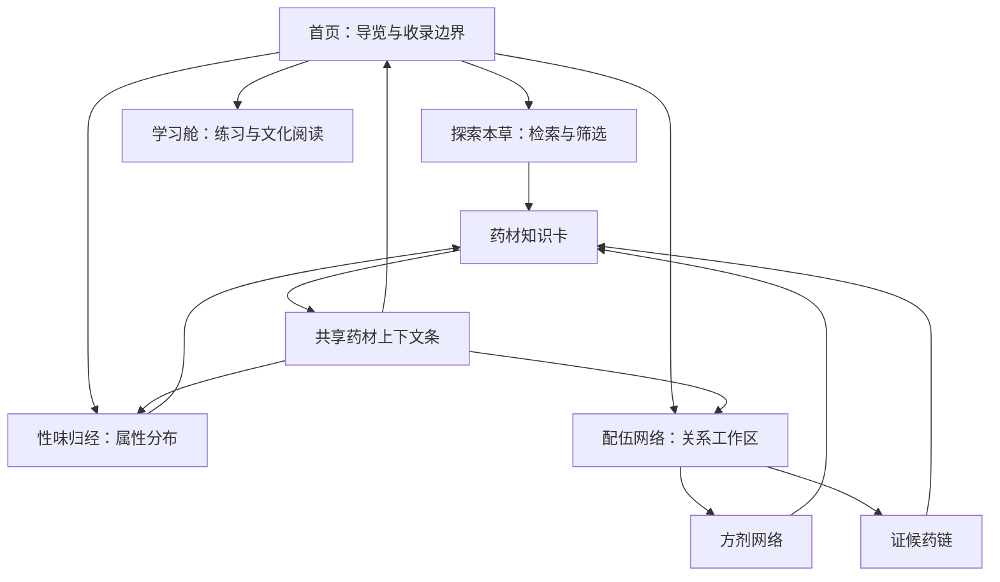

# 本草宇宙 · 网站框架与页面职责

更新日期：2026-10-08。适用于本次发布版本。数据数字来自构建生成的 `reports/data-coverage.json`；历史审计报告保留当时快照。

## 1. 核心判断

当前项目的问题主要是入口、内容层级与页面长度失衡：一个证候视图同时挂在“更多”和配伍网络；首页把全国资源统计与实际馆藏混在一起；配伍页把全部 100 首方剂展开；图表与证据、目录与详情缺少明确的主次。增加页面数量会继续放大这些问题。

建议以“找资料 → 看分布 → 看关系 → 做练习”为主线，形成五个功能区域，药材知识卡作为共享详情层。首页承担导览，完整数据留在对应工作区。每个页面围绕一种主要任务组织内容。

## 2. 本次已落地的导航

顶栏保留首页、探索本草、性味归经、配伍网络；“更多”仅保留学习舱。首页新增四个按任务命名的入口，使学习舱也能直接到达。病证药链从“更多”删除，证候视图的当前导航归属统一为配伍网络。旧 `#/zheng` 链接继续转到证候视图。

下一步建议把学习舱直接放入顶栏，取消仅有一个选项的“更多”。这属于下一阶段的导航调整；本次保留用户熟悉的“更多”位置。

收藏、搜索、主题、药材上下文条是全局工具，不再各占一张内容页面。

## 3. 五个功能区域的职责

| 区域 | 用户主要任务 | 主要内容 | 内容深度与出口 |
|---|---|---|---|
| 首页 | 理解项目、选一种探索方式 | 星图、资源背景、真实馆藏、资料覆盖、精选、食养、典籍、来源 | 展示摘要；进入检索、分布、关系或学习 |
| 探索本草 | 找到一味药或一条名称记录 | 精品卡与名称索引两个数据层、紧凑筛选、分页结果、资料覆盖 | 先结果后分析；药材进入知识卡，索引进入来源 |
| 性味归经 | 理解当前样本的属性分布 | 四气×五味、归经排行、四气占比、五味分布、共归经、分类流向 | 图表选中 → 证据药材 → 知识卡 |
| 配伍网络 | 追踪证—方—药关系 | 方剂网络、证候药链两个视图、检查器、配伍样本统计、方剂目录 | 选方或选证 → 原载组成、角色与来源 → 药材详情 |
| 学习舱 | 练习识药与文化阅读 | 文本测验、来源生物照片测验、文化与非遗阅读 | 明确反馈；知识资料仍回到对应详情 |

### 首页：摘要与方向

本次页面顺序为：

1. 星图与品牌引导。
2. 全国资源、典籍与药典的背景统计。
3. 真实馆藏：902 张知识卡、8,818 条名称索引、100 首方剂、624 张开放图片；四项均可点击。
4. 任务入口：查一味药 / 看属性分布 / 追一组关系 / 练习与阅读。
5. 资料覆盖与分类速览。
6. 精选本草。
7. 食养同源横览。
8. 典籍时光。
9. 项目来源、图像署名与使用边界。

章节导航压缩为档案、精选、食养、典籍、来源五节。统计说明有独立留白；章节导航与药材上下文条按实际高度叠放；点击章节时标题完整露出。

资源背景数字与可浏览馆藏采用两种口径说明。18,817 不等于本项目拥有 18,817 张完整药材卡。首页不重复展开方剂目录或完整学习题库。

### 探索本草：检索优先

保留“精品知识卡 / 名称索引”两层，两个层级的字段能力不同。精品层可以筛选四气、五味、分类、图片与来源；名称索引只证明名称和出处，不参与药性分布图。

页面顺序应保持：标题与样本说明 → 数据层切换 → 紧凑筛选 → 结果数量 → 表格或移动卡片 → 分页 → 可折叠的收录分析。

本次完善了名称占位与失败图片状态、统一“待补充”文案。下一阶段建议把页面底部的地区分布和资料完整度收进“收录分析”折叠区，让首要检索任务更集中；移动端每页结果可进一步降至 12–24 张。

### 性味归经：一页围绕一个分布样本

默认分母统一为 902 张精品卡，排除仅目录身份的 17 条记录和原方物料。复合五味分别计入各味型，因此五味总计可以大于样本数；矩阵与五味柱状图共用拆分规则。

推荐阅读顺序：样本范围 → 主矩阵 → 排行与比例 → 单维分布 → 选中药材检查器 → 延伸关系。

桌面主矩阵占约 60%，侧栏占约 40%；侧栏用排行与比例分担高度。移动端按主矩阵、归经、四气、五味顺序排列。图表先定尺寸，再按容器调整，避免所有图套用同一种最小高度。

下一阶段建议将共归经网络与归经→分类流向并入“延伸关系”折叠区，并为桑基图增加类别选择，降低 28 类同时显示的密度。

### 配伍网络：关系、证据与目录三层

方剂网络和证候药链属于同一工作区的两个视图，各有主任务：前者从方剂或药材看组成，后者从证候看关联方剂及核心药材。证候视图不再另设导航入口。

方剂视图的页面顺序为网络工作区 → 配伍样本统计 → 搜索与分页目录。本次目录每页 12 首，搜索覆盖方名、典籍、主治、功效与组成药材，保留全部 100 首可达。卡片展示名称、来源、组成摘要和详情入口；剂量、君臣佐使与长说明集中在关系检查器。

这使桌面配伍页从约 10,905px 降至约 4,607px；它仍是一张内容较深的分析页。下一阶段可把高频、角色、共现、剂量统计做成页内“配伍统计”标签，进一步控制单次展示量。

方剂统计包含原方物料的真实名称；属性分布采用精品卡样本。两者的实体范围不同，不能为了统一数字而删掉原方古名。

### 学习舱：练习与文化阅读

保留文本测验和照片测验两个入口；文化与非遗阅读放在其后。首页通过任务导览与来源区引导进入。

照片测验应明确是在辨认来源生物参考图，不能据此认定药材采收部位或炮制状态。后续题库应以明确适合识别的图片子集为基础，避免同源照片形成无法区分的答案。

## 4. 共享详情与数据状态

药材知识卡统一承接图像、属性、来源、关联方剂。没有照片时展示名称档案与“照片待补”，没有归经时展示“归经待补充”，避免把缺失写成零条事实。空小记给出查看来源的下一步。

| 状态 | 页面显示 | 应有动作 |
|---|---|---|
| 有核验照片 | 来源生物参考图及署名 | 展开图像来源和许可 |
| 尚无照片 | 名称档案、照片待补 | 查看现有文字资料 |
| 照片网络失败 | 名称档案、加载失败 | 刷新或联网后重试 |
| 属性缺失 | 待补充 | 查看资料分层与出处 |
| 名称索引条目 | 仅名称资料 | 打开行级来源，不生成虚构药性 |
| 原方物料或古名 | 保留原载名称 | 查看方剂来源与名称边界 |

图片覆盖、本草事实完整度、逐行来源、省级分布各自独立计数，能够重叠，不能相加。624 张有图的卡对应 562 个唯一文件，允许明确说明的同源复用。

## 5. 统一的版式和视觉规则

- 普通页面使用统一最大宽度、标题与样本说明。图表证据保持紧邻，减少在长页面中来回查找。
- 首页展示精选摘要，目录分页，长说明折叠。完整资料保留在详情或检查器中。
- 横向滚动只用于明确的卡片横览、表格或索引，不靠隐藏整页溢出来修版面。
- 背景、卡片、柔和面板、边框、主要与辅助文字均使用主题令牌；令牌在 `body` 的主题作用域内解析。夜读模式包含页脚、菜单、按钮、反馈和图表。
- 实心按钮的文字颜色随强调背景切换，日间和夜读都保留清晰对比。
- 动效服务于定位与反馈。真实数据数字保持稳定；资源背景可保留轻量动画。减少动效设置下直接显示最终内容。
- 顶栏、上下文条、章节导航使用实际测量的避让高度，支持移动端换行、字体缩放与关闭上下文条。

## 6. 分阶段实施边界

| 阶段 | 内容 | 本次状态 |
|---|---|---|
| 修复当前体验 | 重叠、零统计、缺图空格、深色面板、菜单重复、按钮对比 | 已实现并加入回归 |
| 收拢页面长度 | 首页任务导览、真实馆藏可点击、方剂目录检索与分页 | 已实现 |
| 完善口径与资料 | 属性图排除目录身份、方剂古名正确显示、来源照片补入与校验 | 已实现；624 张有图，278 张仍待补 |
| 页面进一步精简 | 学习舱直接入顶栏、收录分析折叠、配伍统计标签、延伸关系折叠 | 后续建议 |
| 内容继续扩展 | 字段级出处、更多实物与炮制照片、文化条目、可核验应季专题 | 后续建议，需逐条证据 |

## 7. 后续验收标准

每次改版至少检查五个功能区域与药材详情：日间/夜读、320/375px 移动端与桌面、键盘操作、减少动效、加载失败和空结果。

数据数字必须从当前生成物读取。方剂目录分页必须完整覆盖 100 首；切主题与切路由后统计保持真实；照片失败有可读替代；章节标题在导航下方完整显示；旧证候链接继续可用。

自动测试和桌面浏览器模拟能够验证结构与状态。真实 iOS/Android、屏幕阅读器和低带宽性能仍需设备验收。当前开放图片共约 66.74MB，后续应建立缩略图、WebP 和响应式图片管线，而非把全集加载进首屏。
