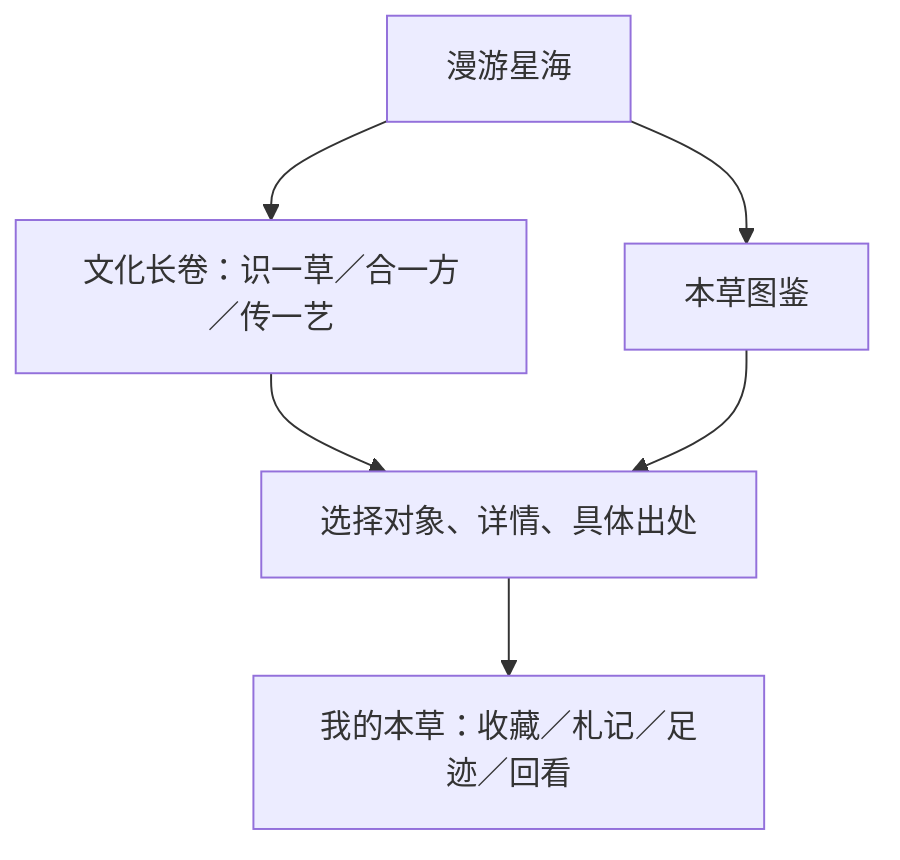

# 本草宇宙 · 网站框架 V7

2026-10-09。当前代码职责与已落地行为；历史V6报告保留日期快照。验收、预算与未交付目标见[V7报告](../reports/2026-10-09-v7-release.md)。

三个顶部主链接，搜索／主题／我的本草为工具。根地址与无参数intro进入星海，典籍旧锚点进入图鉴文化资料。exhibition-router集中兼容映射，runtime驱动既有资料工作区，exhibition承载三章SVG与札记；详尽数据仅有一个完整承载地。

| 模块 | 职责与契约 |
|---|---|
| 数据层 | 保留902卡、8818索引、100方、106目录与稳定ID；缺字段不推断 |
| cosmos-layout | 按资料分类稳定分组；节点位置为设计布局，边为实际方剂组成 |
| cosmos-engine／cosmos-webgl | 共享布局、拾取、选择、相机；HTTP(S)按需增强、Canvas／静态列表降级 |
| exhibition-cases | 八卡五味、三方角色、两技艺专题的具体断言与证据，不修改全量事实 |
| exhibition | 每章一图、一个选择、来源展开、可编辑札记／SVG；主题变化保留草稿 |
| 图鉴 | 知识卡／索引、属性主图切换、方剂资料、完整典籍、来源账本；省级／完整度补充分析主动展开 |
| app-shell／sw | V22必要外壳与离线回退；增强vendor、ECharts、图片和索引分块不安装预下载 |

星海文字区、场景、选中详情采用真实阅读列。移动默认允许页面滚动，进入漫游后接管手势并可退出。三主题、减少动效、键盘列表与无WebGL回退保持可读。离开页面、隐藏文档或场景离开视窗暂停绘制。星辰数量只代表知识卡，装饰尘埃不可选。

index CSS/JS带V7发布查询版本：旧worker按完整URL拦截不会送出旧脚本，新worker按路径匹配新缓存。用户接受更新后跳过等待并重载；新安装成功再清除旧版缓存。本机收藏、足迹、主题、练习与札记均保留，存储失败明确本次页面暂存。

构建为静态目录，不引入React。build:data与build:browser可复现；build:cosmos产物独立预算550000 raw／140000 gzip字节，不能与初始静态JS混算。npm ci --ignore-scripts已用于本地与CI，esbuild平台二进制由锁定可选包提供。

旧缓存升级回归从Git历史37c61a7读取实际旧外壳与worker；运行此用例需要该历史对象。browser-quality使用fetch-depth:0，其他构建job保留浅克隆。升级用例按当前Playwright项目复用视口、触屏、移动标记与设备像素比。

仍完整加载知识卡详情数据；轻量入口数据切片未交付。测试条件、LCP／CLS与30秒实际帧间隔在报告披露；不是用绘制函数成本代替帧率。Pages部署路径保持gh-pages根目录，公开校验由发布维护者执行。
